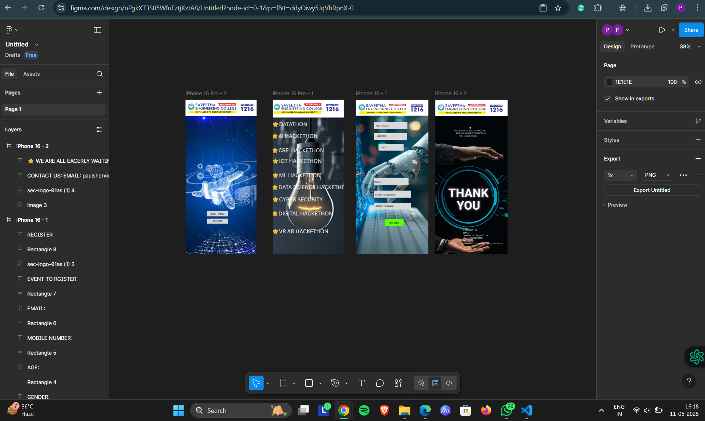

# Ex09 Event Registration Web Application
## Date:

## AIM:
To design, develop and deploy a web application for event registration.

## DESIGN STEPS:

### Step 1:
Create a new frame.

### Step 2:
Select any one preset size of your choice.

### Step 3:
Select the shapes you need.

### Step 4:
Import images as needed.

### Step 5:
Create pages based on your need and link them.

### Step 6:

Validate the HTML and CSS code.

### Step 6:

Publish the website in the given URL.

## DESIGN TOOL:
Figma

## CODE:
```
HOME PAGE:
<!DOCTYPE html>
<html lang="en">
<head>
  <meta charset="UTF-8">
  <title>Hacketho Registration</title>
  <style>
    * {
      margin: 0;
      padding: 0;
      box-sizing: border-box;
      font-family: Arial, sans-serif;
    }

    body, html {
      height: 100%;
      width: 100%;
    }

    .container {
      background-image: url('background.png'); /* Replace with your image file */
      background-size: cover;
      background-position: center;
      height: 100vh;
      display: flex;
      flex-direction: column;
      align-items: center;
      justify-content: flex-end;
      padding-bottom: 100px;
    }

    .button {
      background-color: rgba(255, 255, 255, 0.9);
      border: none;
      padding: 10px 20px;
      margin: 10px;
      font-size: 16px;
      cursor: pointer;
      border-radius: 5px;
      transition: 0.3s ease;
    }

    .button:hover {
      background-color: #cfe6ff;
    }

    .logo-bar {
      position: absolute;
      top: 0;
      width: 100%;
      background-color: white;
      padding: 10px;
      display: flex;
      justify-content: space-between;
      align-items: center;
      box-shadow: 0 2px 5px rgba(0,0,0,0.2);
    }

    .logo-bar img {
      height: 40px;
    }

    .tnea {
      font-weight: bold;
      color: #2a2a2a;
      font-size: 20px;
    }
  </style>
</head>
<body>
  <div class="logo-bar">
    
    <div class="tnea">TNEA CODE<br>1216</div>
  </div>

  <div class="container">
    <button class="button">LOGIN FORM</button>
    <button class="button">REGISTER</button>
  </div>
</body>
</html>

```
```
PAGE 2:


<!DOCTYPE html>
<html lang="en">
<head>
  <meta charset="UTF-8">
  <title>Hacketho Event List</title>
  <style>
    * {
      margin: 0;
      padding: 0;
      box-sizing: border-box;
      font-family: Arial, sans-serif;
    }

    body, html {
      height: 100%;
      width: 100%;
    }

    .page-container {
      background-image: url('bulb-bg.png'); /* Replace with your actual image filename */
      background-size: cover;
      background-position: center;
      height: 100vh;
      color: white;
      padding-top: 100px;
      padding-left: 20px;
    }

    .logo-bar {
      position: absolute;
      top: 0;
      width: 100%;
      background-color: white;
      padding: 10px;
      display: flex;
      justify-content: space-between;
      align-items: center;
      box-shadow: 0 2px 5px rgba(0,0,0,0.2);
    }

    .logo-bar img {
      height: 40px;
    }

    .tnea {
      font-weight: bold;
      color: #2a2a2a;
      font-size: 20px;
    }

    .hackathon-list {
      list-style: none;
      padding: 0;
    }

    .hackathon-list li {
      font-size: 18px;
      margin: 15px 0;
      display: flex;
      align-items: center;
    }

    .star {
      color: gold;
      margin-right: 10px;
      font-size: 20px;
    }
  </style>
</head>
<body>

  <div class="logo-bar">
    
    <div class="tnea">TNEA CODE<br>1216</div>
  </div>

  <div class="page-container">
    <ul class="hackathon-list">
      <li><span class="star">⭐</span>DATATHON</li>
      <li><span class="star">⭐</span>AI HACKETHON</li>
      <li><span class="star">⭐</span>CSE HACKETHON</li>
      <li><span class="star">⭐</span>IOT HACKETHON</li>
      <li><span class="star">⭐</span>ML HACKETHON</li>
      <li><span class="star">⭐</span>DATA SCIENCE HACKETHON</li>
      <li><span class="star">⭐</span>CYBER SECURITY</li>
      <li><span class="star">⭐</span>DIGITAL HACKETHON</li>
      <li><span class="star">⭐</span>VR AR HACKETHON</li>
    </ul>
  </div>

</body>
</html>

```
```
PAGE 3:

<!DOCTYPE html>
<html lang="en">
<head>
  <meta charset="UTF-8">
  <title>Hackathon Registration</title>
  <style>
    * {
      margin: 0;
      padding: 0;
      box-sizing: border-box;
      font-family: Arial, sans-serif;
    }

    body, html {
      height: 100%;
      width: 100%;
    }

    .page-container {
      background-image: url('robot-bg.png'); /* Replace with your actual image */
      background-size: cover;
      background-position: center;
      height: 100vh;
      padding-top: 120px;
      display: flex;
      flex-direction: column;
      align-items: center;
    }

    .logo-bar {
      position: absolute;
      top: 0;
      width: 100%;
      background-color: white;
      padding: 10px;
      display: flex;
      justify-content: space-between;
      align-items: center;
      box-shadow: 0 2px 5px rgba(0,0,0,0.2);
    }

    .logo-bar img {
      height: 40px;
    }

    .tnea {
      font-weight: bold;
      color: #2a2a2a;
      font-size: 20px;
    }

    form {
      display: flex;
      flex-direction: column;
      width: 80%;
      max-width: 300px;
    }

    input[type="text"],
    input[type="email"],
    input[type="number"] {
      padding: 10px;
      margin: 10px 0;
      border: none;
      outline: none;
      border-radius: 5px;
      background-color: rgba(255,255,255,0.9);
    }

    .register-btn {
      margin-top: 15px;
      padding: 12px;
      background-color: #00ff00;
      border: none;
      color: black;
      font-weight: bold;
      cursor: pointer;
      border-radius: 5px;
      font-size: 16px;
    }

    .register-btn:hover {
      background-color: #00cc00;
    }
  </style>
</head>
<body>

  <div class="logo-bar">
    
    <div class="tnea">TNEA CODE<br>1216</div>
  </div>

  <div class="page-container">
    <form>
      <input type="text" placeholder="FULL NAME:" required>
      <input type="text" placeholder="GENDER:" required>
      <input type="number" placeholder="AGE:" required>
      <input type="email" placeholder="EMAIL:" required>
      <input type="text" placeholder="EVENT TO REGISTER:" required>
      <input type="text" placeholder="MOBILE NUMBER:" required>
      <button class="register-btn">REGISTER</button>
    </form>
  </div>

</body>
</html>

```
```
PAGE 4:

<!DOCTYPE html>
<html lang="en">
<head>
  <meta charset="UTF-8">
  <title>Thank You - Hackathon</title>
  <style>
    * {
      margin: 0;
      padding: 0;
      font-family: Arial, sans-serif;
      box-sizing: border-box;
    }

    body, html {
      height: 100%;
      width: 100%;
    }

    .thankyou-container {
      background-image: url('thankyou-bg.png'); /* Replace with your image name */
      background-size: cover;
      background-position: center;
      height: 100vh;
      display: flex;
      flex-direction: column;
      align-items: center;
      justify-content: flex-start;
      padding-top: 120px;
      text-align: center;
      color: white;
    }

    .logo-bar {
      position: absolute;
      top: 0;
      width: 100%;
      background-color: white;
      padding: 10px;
      display: flex;
      justify-content: space-between;
      align-items: center;
      box-shadow: 0 2px 5px rgba(0,0,0,0.2);
    }

    .logo-bar img {
      height: 40px;
    }

    .tnea {
      font-weight: bold;
      color: #2a2a2a;
      font-size: 20px;
    }

    .message {
      margin-top: 20px;
      font-size: 14px;
      font-weight: bold;
    }

    .thank-you {
      font-size: 48px;
      font-weight: bold;
      margin-top: 30px;
      text-shadow: 2px 2px 10px black;
    }

    .contact-info {
      position: absolute;
      bottom: 20px;
      left: 20px;
      font-size: 13px;
      color: white;
      text-align: left;
    }
  </style>
</head>
<body>

  <div class="logo-bar">
    
    <div class="tnea">TNEA CODE<br>1216</div>
  </div>

  <div class="thankyou-container">
    <div class="message">
      ⭐<br>
      WE ARE ALL EAGERLY WAITING <br> FOR YOUR PARTICIPATION <br> IN THE HACKETHON
    </div>
    <div class="thank-you">THANK YOU</div>

    <div class="contact-info">
      <strong>CONTACT US:</strong><br>
      EMAIL: paulshervin77@gmail.com<br>
      PHONE: 7992986140<br>
      ADDRESS: Saveetha Engineering College, Thandalam
    </div>
  </div>

</body>
</html>

```


## OUTPUT:



## RESULT:
The program to design, develop and deploy a web application for event registration is completed successfully.
